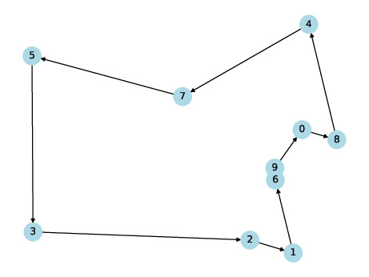

# Pointer Net

Reproduce this paper
> Vinyals, O., Fortunato, M., & Jaitly, N. (2015). Pointer networks. Advances in neural information processing systems, 28.

## How to run the code

1. Install dependencies
```sh
pip3 install -r requirements.txt
```

2. Prepare the dataset

- random 2D TSP coordinates of $$N$$ nodes ($$X$$)
- optimal solution, a permutation of $$N$$ nodes ($$Y$$)

```sh
make prepare
```
Change `args.n_instance` and `args.n_node` depending on your experimental setup.

3. Visualize the generated data

```sh
make plot
```




4. Train the model

```sh
make train
```

Output data

- `../data/csv/*.csv`: log optimality gap of train/test dataset, train CrossEntropyLoss
- `../data/model/*.pkl`: best model by optimality gap of train dataset

5. Visualize the training progress

```sh
make plot
```

Output data

- `../data/figure/*.jpg`: line plot of log optimality gap of train/test dataset, train CrossEntropyLoss

Example: Convergence chart of training on 2000 examples, testing on 200 examples, for TSP problem with 5 nodes.


## TODO

- [x] Visualize the generated tours
- [x] Inference (test) from random (untrained) model
- [x] Train model
- [ ] Train with correct parameter from original paper
